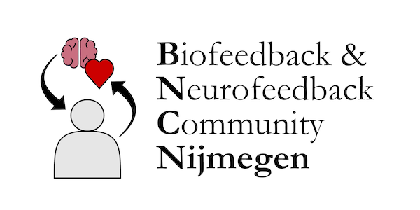

  

The _Biofeedback & Neurofeedback Community Nijmegen (BNCNijmegen)_ is an initiative to bring together Bio- and Neurofeedback researchers across the Radboud campus
by providing a platform for knowledge exchange and collaboration, aimed at making Nijmegen a central hub of expertise in Bio- and Neurofeedback research in the Netherlands.

**Join us on: [GitHub](https://github.com/orgs/bncnijmegen) | [Matrix](https://matrix.to/#/#bncnijmegen:matrix.org)**

For more information, please contact Florian Krause (florian.krause@donders.ru.nl)
