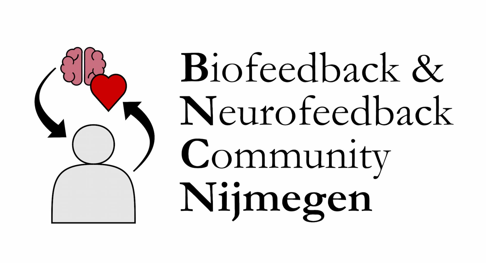

  

The _Biofeedback & Neurofeedback Community Nijmegen (BNCNijmegen)_ is an initiative to bring together Bio- and Neurofeedback researchers across the Radboud campus
by providing a platform for knowledge exchange and collaboration, aimed at making Nijmegen a central hub of expertise in Bio- and Neurofeedback research in the Netherlands.

<strong>Become a member by subscribing to our [mailing list](https://mailing.ru.nl/mailman/listinfo/bncnijmegen)!</strong>

    <strong>Also join us online:</strong>    

    <!-- GitHub -->
    <a href="https://github.com/orgs/bncnijmegen" style="display: inline-flex; align-items: center; gap: 0.25em;">
       
        <strong>GitHub</strong>
    </a>

    <!-- Matrix -->
    

        <a href="https://matrix.to/#/#bncnijmegen:matrix.org" style="display: inline-flex; align-items: center; gap: 0.25em;">
            
            <strong>Matrix</strong>
        </a>
        
            (<a href="https://gist.github.com/fladd/c26524e385957f0a654a46d74d3a7598" target="_blank" rel="noopener">Instructions</a>)
        
    

    <!-- LinkedIn -->
    <a href="https://www.linkedin.com/company/bio-and-neurofeedback-community-nijmegen" style="display: inline-flex; align-items: center; gap: 0.25em;">
        
        <strong>LinkedIn</strong>
    </a>

For more information, please contact florian.krause@donders.ru.nl.

 

<h3>Latest Activities</h3>

[!PAGES Date]
